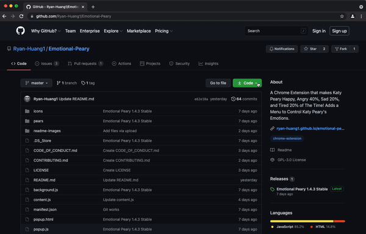
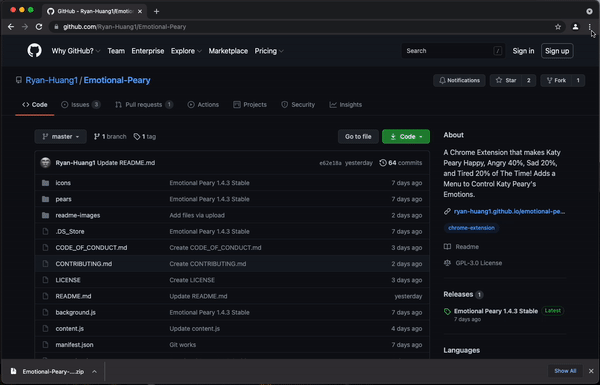
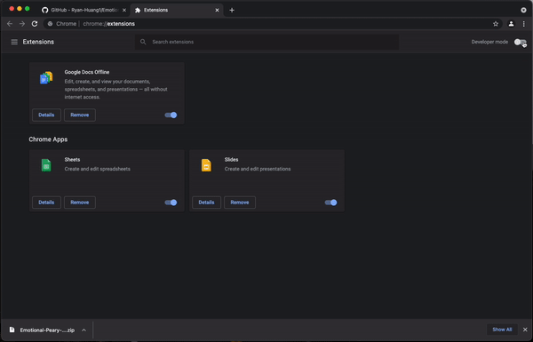
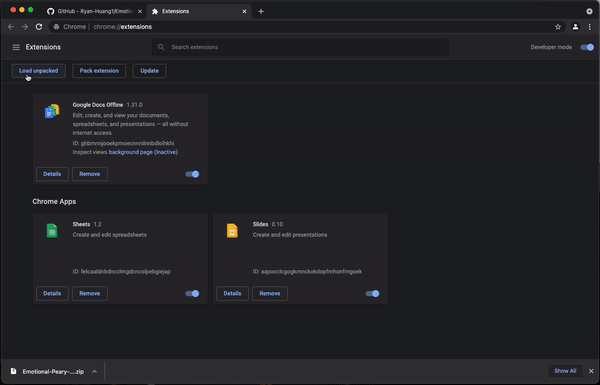

# Emotional Peary

         

This is a Chrome Extension that makes Katy Peary have diffrent emotions randomaly! Also adds a menu to control Katy Peary's emotions manually

---

## Setup

> Downlaod the Repository to your local computer by clicking the green `Code` button, then click `Download ZIP`.

> Open the Extention Menu in Chrome by clicking the `Customize and Control Google Chrome` button, hovering over `More Tools`, then clicking `Extensions`

> Turn on Developer Mode by clicking on the blue switch

> Click the button Load Unpacked then select the folder "Emotional-Peary-master" 

And you're set, enjoy 🥳!

---

## License

> Read the [licence](https://github.com/Ryan-Huang1/Emotional-Peary/blob/master/README.md) 

Ryan-Huang1/Emotional-Peary is licensed under the **GNU General Public License v3.0**
